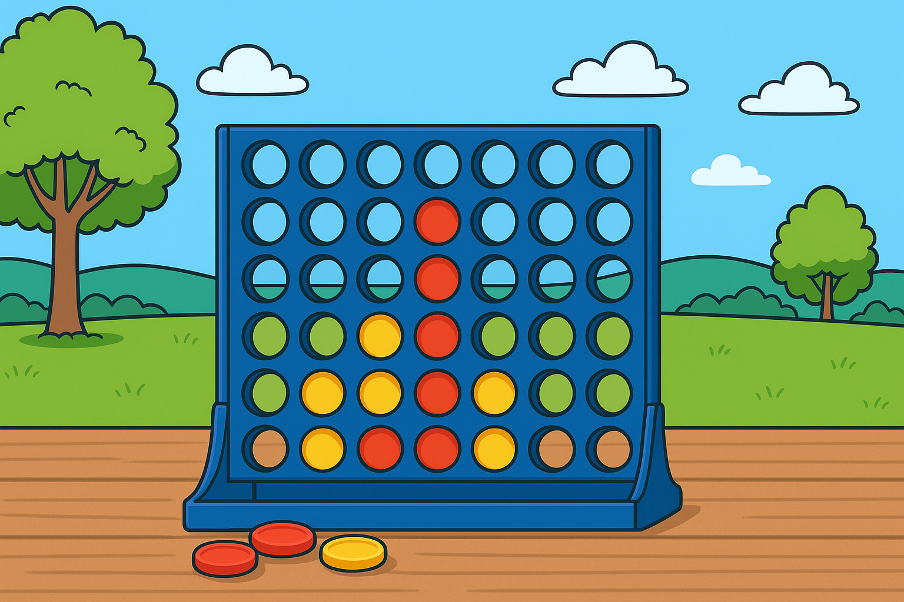

# 🚀 Connect 4 Game (Space Theme)

A playful and interactive web-based Connect 4 game with a space-themed twist, featuring animated astronaut and alien tokens, sound effects, dynamic gameplay modes, and multiple difficulty levels. Built using vanilla JavaScript, HTML, and CSS for a fully responsive and engaging user experience.
----------
## 🌌 Features
- 🧑‍🚀 Player vs Player and Player vs Computer modes
- 👽 AI Difficulty Modes: Easy and unlockable Normal
- 🪐 Multiple board sizes: 4×5, 5×6, 6×7, and 7×8
- 🪐 Custom token design: Astronaut (Green) and Alien (Red)
- 🔊 Game sounds for click, drop, start, and win events
- 💾 Win count is saved using LocalStorage
- 📱 Responsive and interactive UI with falling token animation
- 🧠 Intelligent computer opponent in normal mode
----------
## 🕹️ Gameplay Instructions
1. Launch the game in your browser.
2. Click START GAME to begin.
3. Choose game mode (Player vs Player / Player vs Computer).
4. If Player vs Computer, select Easy or Normal (unlocks after a win).
5. Choose your board size and token (Alien or Astronaut).
6. Take turns dropping tokens into the grid.
7. First to connect four tokens horizontally, vertically, or diagonally wins!
8. The game announces wins, tracks score, and allows reset or clear.
----------
## 📁 Folder Structure
/connect4-space-theme
│
├── index.html
├── css/
│ └── style.css
├── js/
│ └── app.js
├── assets/
│ ├── images/
│ │ ├── alien.png
│ │ └── astro.png
│ └── sounds/
│ ├── click.mp3
│ ├── start.mp3
│ ├── token.mp3
│ ├── loose.mp3
| ├── tie.mp3
| ├── back.mp3
│ └── win.mp3
└── README.md

## 🧠 Technical Highlights

- DOM construction: Board and cells are generated based on selected board size.
- Token drop animation: Tokens visually fall from the top cell to their final spot.
- Winner detection: Checks for 4 in raw combination of tokens in all directions.
- AI behavior: 
1. Easy: Random column selection.
2. Normal: Tries to win or block opponent if none then random columns selection.

## 🎮 Demo
Game Demo can be access by visiting this [link](https://mjassim2030.github.io/Connect-4/)

## 📌 Development Roadmap
- Add animated background transitions
- Responsive Design for Small screens
- Online Multiplayer 
- Enhanced sound and music settings
- Scoreboard and timer modes

## 🪐 Credits
- Icons & illustrations: AI Generated
- Sound effects: Free licensedself-made
Developed by: Mohamed AlMehaiza

## 🔗 References

